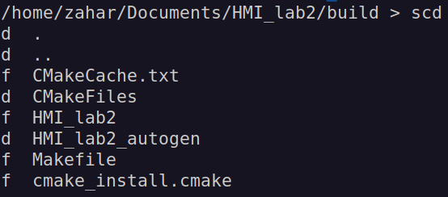
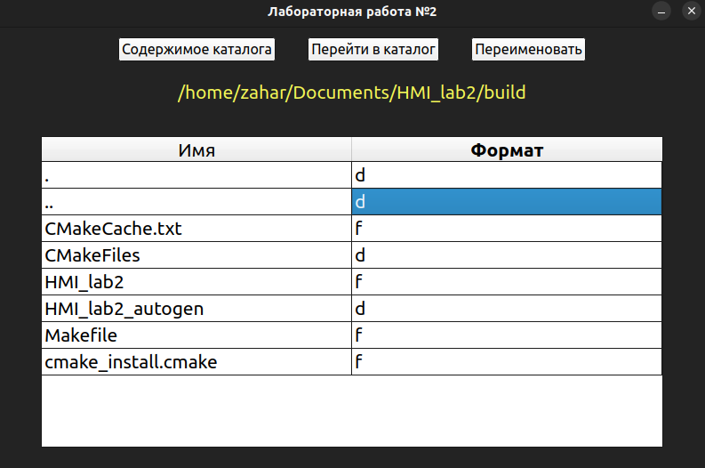

Lab work for human-machine interface class - working with filesystem (homemade terminal or UI)

CLI - if defined C variable (macro) in main.cpp, UI - if M (default: C)

CLI (terminal): 
    
    scd (scd) - show current dir
    
    gtd (gtd /dir name/) - go to dir (. or .. - ok)
    
    rename (rename /old name 1/->/new name 1/ /old name 2/->/new name 2/ ...) - rename file(s)

UI: 

